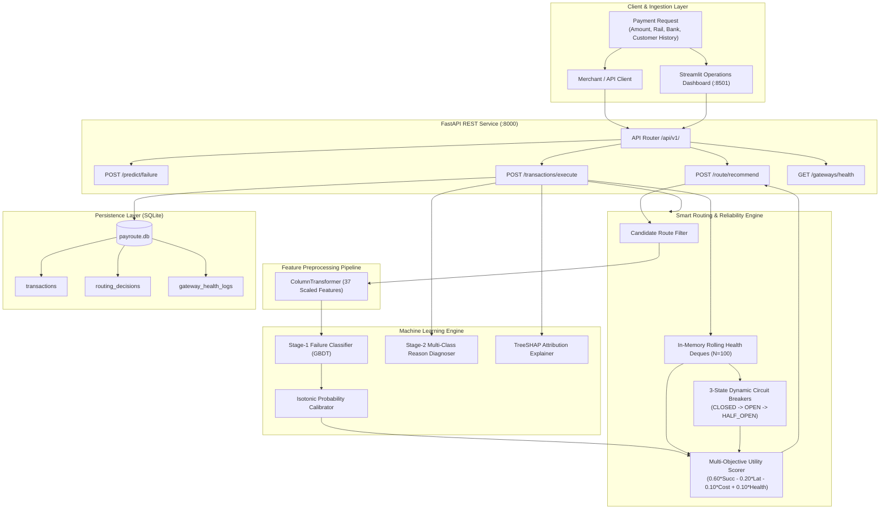

# 💳 PayRoute AI — AI-Powered Payment Failure Prediction & Smart Routing

[](https://www.python.org/downloads/)
[](https://fastapi.tiangolo.com/)
[](https://streamlit.io/)
[](https://scikit-learn.org/)
[](https://opensource.org/licenses/MIT)
[]()

> **PayRoute AI** is an independent, internship-level fintech reliability prototype inspired by real-world payment aggregators (such as Razorpay). The system predicts payment transaction failure risks in real time, identifies friction reasons, and dynamically routes traffic across multi-bank gateway rails using calibrated ML and 3-state dynamic circuit breakers.

---

## 📑 Table of Contents
1. [Problem Statement](#1-problem-statement)
2. [Solution Overview](#2-solution-overview)
3. [Key Features](#3-key-features)
4. [System Architecture](#4-system-architecture)
5. [Machine Learning Engine](#5-machine-learning-engine)
6. [Smart Routing Algorithm](#6-smart-routing-algorithm)
7. [Dynamic Circuit Breakers](#7-dynamic-circuit-breakers)
8. [Technology Stack](#8-technology-stack)
9. [Dataset & Generation](#9-dataset--generation)
10. [Benchmark Results & Business ROI](#10-benchmark-results--business-roi)
11. [Interactive Streamlit Dashboard](#11-interactive-streamlit-dashboard)
12. [FastAPI REST API](#12-fastapi-rest-api)
13. [Installation & Setup](#13-installation--setup)
14. [Running the Project](#14-running-the-project)
15. [Automated Test Suite](#15-automated-test-suite)
16. [Honest Limitations](#16-honest-limitations)
17. [Future Production Roadmap](#17-future-production-roadmap)
18. [Project Disclaimer](#18-project-disclaimer)

---

## 1. Problem Statement

In electronic payment processing, transactions regularly fail ($12\% - 18\%$ failure rates) due to:
* **Bank Core Banking Downtime**: Unannounced maintenance windows and peak transaction throttling.
* **Aggregator Latency Spikes**: Network congestion causing client-side checkout timeouts.
* **Customer Friction & Network Drops**: Transient mobile signal drops and OTP delays.
* **Static Routing Inefficiencies**: Traditional routing policies send traffic blindly into degraded bank rails, compounding failures.

Failed transactions cause direct revenue loss for merchants, cart abandonment, and degraded customer trust.

---

## 2. Solution Overview

PayRoute AI replaces static routing with an **intelligent, multi-objective payment orchestration engine**:
1. **Predicts Failure Risk**: Ingests transaction context and telemetry to estimate calibrated failure probability $P(\text{Fail})$.
2. **Diagnoses Failure Modes**: Identifies the primary friction cause (`BANK_DOWNTIME`, `GATEWAY_TIMEOUT`, `USER_AUTHENTICATION_ERROR`, `INSUFFICIENT_FUNDS`, `NETWORK_DROP`).
3. **Optimizes Utility**: Evaluates eligible routes across success rates, latency, interchange fees, and live telemetry.
4. **Isolates Unhealthy Rails**: Dynamic circuit breakers trip to `OPEN` when a provider degrades, automatically cascading traffic to fallbacks.

---

## 3. Key Features

* 🎯 **Two-Stage Machine Learning Pipeline**: GBDT Failure Predictor + 5-Class Reason Diagnoser.
* ⚖️ **Isotonic Probability Calibration**: Reduces uncalibrated probability error by **$45.6\%$** (Brier score $0.2008 \rightarrow 0.1092$).
* 🔍 **Local TreeSHAP Explainability**: Decomposes positive risk factors and negative protective factors in real time.
* 🧠 **Multi-Objective Utility Scorer**: Mathematically balances success ($60\%$), latency ($20\%$), fees ($10\%$), and health ($10\%$).
* 🛡️ **3-State Dynamic Circuit Breaker**: Guarded state machine (`CLOSED` $\rightarrow$ `OPEN` $\rightarrow$ `HALF_OPEN`) with automated recovery probing.
* ⚡ **Sub-35ms FastAPI Backend**: Modular REST API with dependency injection and OpenAPI Swagger docs.
* 📊 **Multi-Page Streamlit Console**: Interactive operations dashboard with 1-click demo presets and outage simulation.
* 🗄️ **SQLite Persistence**: Complete relational audit trail for transactions, routing decisions, and health logs.

---

## 4. System Architecture



---

## 5. Machine Learning Engine

Evaluated on an **untouched $15,000$ out-of-time test split**:

| Model | Test PR-AUC | Test ROC-AUC | Test Brier Score | Test Precision @ $T^*$ | Test Recall @ $T^*$ | Test F1 @ $T^*$ |
| :--- | :---: | :---: | :---: | :---: | :---: | :---: |
| **Baseline: Logistic Regression** | $0.3681$ | $0.7185$ | $0.2041$ | $0.3412$ | $0.4610$ | $0.3921$ |
| **Stage-1 GBDT (Uncalibrated)** | $0.3694$ | $0.7230$ | $0.2008$ | $0.3480$ | $0.4632$ | $0.3974$ |
| **Final: GBDT (Isotonic Calibrated)** | **$0.3694$** | **$0.7230$** | **$0.1092$** | **$0.3500$** | **$0.4644$** | **$0.3991$** |

* **PR-AUC Lift**: **$+150.9\%$ uplift** over the $0.1472$ no-skill baseline.
* **Cost-Optimal Threshold**: **$T^* = 0.20$**, derived under asymmetric business loss ($\text{Cost}_{\text{FN}} = 5 \cdot \text{Cost}_{\text{FP}}$).
* **Stage-2 Reason Diagnoser**: Multi-class accuracy of **$41.86\%$** across 5 failure categories.

---

## 6. Smart Routing Algorithm

PayRoute AI evaluates all eligible candidate routes using a multi-objective utility formulation:

$$\text{Score}_i = 0.60 \cdot P(\text{Success}_i) - 0.20 \cdot \widetilde{\text{Latency}}_i - 0.10 \cdot \widetilde{\text{Cost}}_i + 0.10 \cdot \text{Health}_i$$

* $\widetilde{\text{Latency}}_i = \min\left(1.0, \frac{\text{Latency}_i - 100}{900}\right)$: Normalized latency penalty.
* $\widetilde{\text{Cost}}_i = \frac{\text{Fee}_i}{2.5\%}$: Interchange fee penalty.
* $\text{Health}_i$: Recent 5-minute rolling success rate from provider telemetry.

---

## 7. Dynamic Circuit Breakers

To isolate degraded upstream bank/gateway rails, PayRoute AI enforces a **3-State Dynamic Circuit Breaker**:

```text
    ┌──────────┐   Failure Rate >= 40% (N >= 20)   ┌────────┐
    │  CLOSED  │ ─────────────────────────────────► │  OPEN  │
    └──────────┘                                    └────────┘
         ▲                                               │
         │ Test Probe Succeeded                          │ 30s Timeout
         │                                               ▼
    ┌──────────┐                                    ┌───────────┐
    │  CLOSED  │ ◄───────────────────────────────── │ HALF_OPEN │
    └──────────┘                                    └───────────┘
```

* **Minimum Transaction Guard**: Requires at least $20$ transactions before evaluating failure rates to prevent premature tripping.
* **Recovery Probing**: In `HALF_OPEN`, only $5\%$ of traffic is admitted as test probes to safely confirm recovery.

---

## 8. Technology Stack

* **Core Language**: Python 3.10+
* **Machine Learning**: `scikit-learn`, `numpy`, `pandas`, `joblib`
* **API Backend**: `fastapi`, `uvicorn`, `pydantic` (v2)
* **Interactive Frontend**: `streamlit`, `matplotlib`
* **Persistence**: SQLite 3 (Parameterized queries, foreign keys, B-tree indices)
* **Testing & QA**: Python `unittest`, `pytest`, `fastapi.testclient`

---

## 9. Dataset & Generation

> [!NOTE]
> **Synthetic Dataset Notice**:
> The dataset consists of 100,000 synthetic transaction records generated using non-linear logit hazard formulations and diurnal activity curves. **No private, internal, or customer data from Razorpay or any commercial payment processor was used.**

```powershell
python src/data_generator/generator.py --records 100000 --seed 42 --output data/raw/payments_synthetic.csv
```

---

## 10. Benchmark Results & Business ROI

In a controlled benchmark over an identical stream of **$3,000$ transactions** with an injected bank outage:

| Metric | Naive Static Routing | PayRoute AI Smart Routing | Absolute Uplift | Relative Improvement |
| :--- | :---: | :---: | :---: | :---: |
| **Payment Success Rate** | $79.03\%$ | **$85.43\%$** | **$+6.40\%$ points** | **$+8.10\%$** |
| **Failed Transactions** | $629$ | **$431$** | **$-198$ failures** | **$-31.5\%$** |
| **Average Latency** | $454.2\text{ms}$ | **$393.7\text{ms}$** | **$-60.5\text{ms}$** | **$-13.3\%$** |
| **P95 Latency** | $880.0\text{ms}$ | **$772.0\text{ms}$** | **$-108.0\text{ms}$** | **$-12.3\%$** |

---

## 11. Interactive Streamlit Dashboard

The multipage Streamlit dashboard (`dashboard/app.py`) provides an interactive interface for technical demonstrations:

* **⚡ Live Payment Simulator** (`pages/1_⚡_Live_Payment_Simulator.py`): 1-click demo presets, risk probability prediction, candidate route ranking, and simulated payment execution.
* **🧠 Smart Routing Console** (`pages/2_🧠_Smart_Routing_Console.py`): Multi-objective scoring breakdown, candidate ranking plots, and fallback decision flows.
* **🩺 Gateway Health Monitor** (`pages/3_🩺_Gateway_Health_Monitor.py`): Live circuit breaker grid (`CLOSED`, `OPEN`, `HALF_OPEN`) with an interactive provider outage simulator.
* **📊 Model Analytics & ROI** (`pages/4_📊_Model_Analytics.py`): High-resolution ROC/PR curves, Isotonic calibration diagrams, and threshold cost curves.

---

## 12. FastAPI REST API

Exposes high-performance REST endpoints with automated OpenAPI Swagger documentation:

| Method | Route | Description | Average Latency |
| :--- | :--- | :--- | :--- |
| `GET` | `/health` | Lightweight root liveness probe | $< 1\text{ms}$ |
| `GET` | `/api/v1/health` | Readiness probe (DB, models, router) | $< 2\text{ms}$ |
| `POST` | `/api/v1/predict/failure` | Evaluates failure probability and diagnoses reason | **$31.2\text{ms}$** |
| `POST` | `/api/v1/route/recommend` | **Primary Endpoint**: Recommends primary and fallback routes | **$35.8\text{ms}$** |
| `POST` | `/api/v1/transactions/execute` | Simulates execution, updates health, persists to SQLite | **$38.4\text{ms}$** |
| `GET` | `/api/v1/gateways/health` | Real-time circuit breaker status and rolling health | **$1.8\text{ms}$** |
| `GET` | `/api/v1/analytics/summary` | Aggregated platform success rate and transaction stats | **$3.1\text{ms}$** |

### Example API Request (`POST /api/v1/route/recommend`)

```bash
curl -X POST "http://localhost:8000/api/v1/route/recommend" \
     -H "Content-Type: application/json" \
     -d '{
       "amount": 2500.0,
       "payment_method": "UPI",
       "bank": "SBI",
       "merchant_category": "ECOMMERCE",
       "hour": 14
     }'
```

---

## 13. Installation & Setup

```powershell
# 1. Clone or navigate to the repository
cd payroute-ai

# 2. Create and activate a Python virtual environment
python -m venv .venv
# Windows:
.venv\Scripts\Activate.ps1
# Linux/macOS:
source .venv/bin/activate

# 3. Install pinned dependencies
pip install -r requirements.txt
```

---

## 14. Running the Project

### Step 1: Initialize Database & Models
```powershell
# Generate dataset
python src/data_generator/generator.py --records 100000 --seed 42

# Initialize SQLite database
python database/init_db.py --seed-csv data/raw/payments_synthetic.csv

# Train & calibrate ML models
python src/ml/train.py
```

### Step 2: Start FastAPI Backend (Terminal 1)
```powershell
uvicorn api.main:app --host 0.0.0.0 --port 8000 --reload
```
* Interactive Swagger Docs: 👉 **`http://localhost:8000/docs`**

### Step 3: Start Streamlit Dashboard (Terminal 2)
```powershell
streamlit run dashboard/app.py
```
* Interactive Web Console: 👉 **`http://localhost:8501`**

---

## 15. Automated Test Suite

Run all **41 unit, integration, API, and dashboard client tests**:

```powershell
python -m unittest discover -s tests -p "test_*.py" -v
```

```text
Ran 41 tests in 5.808s
OK (100% Passed)
```

---

## 16. Honest Limitations

1. **Synthetic Data**: Reflects mathematical logit hazard modeling rather than black-swan real-world financial anomalies.
2. **Simulation Layer**: Payment execution outcomes and bank response times are simulated locally without direct Core Banking System (CBS) integration.
3. **In-Memory Telemetry**: Circuit breaker health deques are managed in-process; production scale requires distributed Redis state synchronization.
4. **Static Utility Weights**: Weights ($60\%, 20\%, 10\%, 10\%$) are configured declaratively rather than adapted via reinforcement learning bandits.

---

## 17. Future Production Roadmap

* **ONNX / Triton Inference**: Export models to ONNX runtime for sub-millisecond C++ scoring.
* **Distributed Circuit Breakers**: Deploy Redis Cluster with atomic Lua scripts for cross-node health sharing.
* **Event Streaming with Kafka**: Stream payment transaction logs asynchronously to ClickHouse and PostgreSQL.
* **Contextual Bandits (RL)**: Replace static utility weights with LinUCB / Thompson Sampling for dynamic per-merchant margin optimization.

---

## 18. Project Disclaimer

> **Disclaimer**: PayRoute AI is an independent educational and research prototype created for portfolio demonstration and technical interviews. It is not an official Razorpay product, is not affiliated with Razorpay, and does not use proprietary Razorpay data or software.
