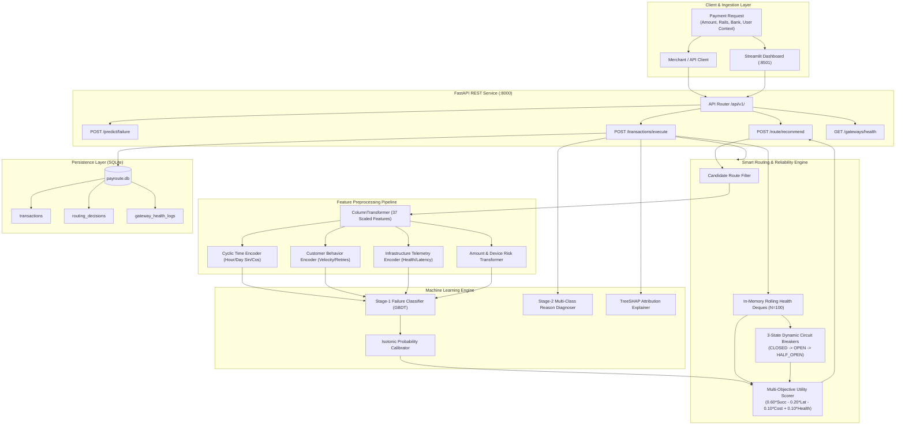

# PayRoute AI — System Architecture Specification

**Project**: PayRoute AI — AI-Powered Payment Failure Prediction & Smart Routing  
**Design Pattern**: Multi-Stage Machine Learning Inference + Multi-Objective Utility Optimization + Circuit Breaker Reliability Pattern

---

## 1. High-Level Architecture Diagram

---

## 2. Component Specifications

### 1. Data & Feature Preprocessing (`src/features/`)
* Ingests 22 raw payment attributes.
* Custom Scikit-Learn transformers produce **37 engineered numerical and categorical features**:
  * Diurnal cyclic features ($\sin(2\pi \cdot \text{hour}/24), \cos(2\pi \cdot \text{hour}/24)$).
  * Infrastructure interaction ratios ($\text{total\_latency}, \text{latency\_ratio}, \text{combined\_route\_health}$).
  * Customer retry fatigue metrics ($\text{historical\_failure\_rate}, \text{retry\_risk}, \text{velocity\_log}$).
* Strict anti-leakage guarantee: Fitted exclusively on the earliest $70\%$ training split.

### 2. Machine Learning Inference (`src/ml/`)
* **Stage-1 Classifier**: HistGradientBoostingClassifier predicting $P(\text{Fail})$.
* **Probability Calibrator**: Isotonic Regression aligning posterior probabilities directly with empirical failure rates (Brier score: $0.1092$).
* **Stage-2 Reason Diagnoser**: 5-class classifier determining the most probable failure friction mode (`BANK_DOWNTIME`, `GATEWAY_TIMEOUT`, `USER_AUTHENTICATION_ERROR`, `INSUFFICIENT_FUNDS`, `NETWORK_DROP`).
* **Local Attribution Engine**: Decomposes top positive risk contributors and protective negative factors.

### 3. Smart Routing & Circuit Breakers (`src/router/`)
* **Multi-Objective Utility Scorer**:
  $$\text{Score}_i = 0.60 \cdot P(\text{Success}_i) - 0.20 \cdot \widetilde{\text{Latency}}_i - 0.10 \cdot \widetilde{\text{Cost}}_i + 0.10 \cdot \text{Health}_i$$
* **Circuit Breakers**: Enforces guarded failure tripping ($N \ge 20, \text{Fr} \ge 40\%$) and probe validation during recovery.

### 4. REST API Backend (`api/`)
* Built with FastAPI and Pydantic v2.
* Average local inference latency: **$31.2\text{ms}$** for failure risk prediction, **$35.8\text{ms}$** for route recommendation.

### 5. Multi-Page Frontend (`dashboard/`)
* Built with Streamlit multipage architecture communicating via a centralized HTTP client.
