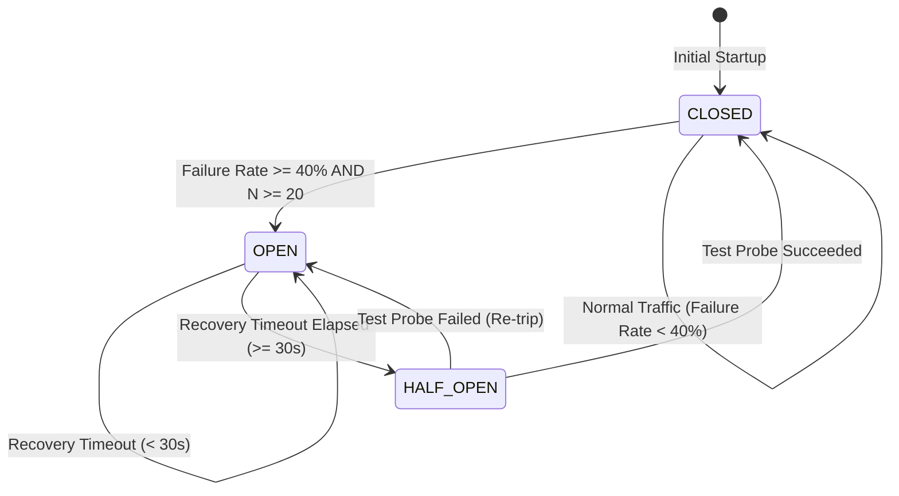

# PayRoute AI — Dynamic 3-State Circuit Breaker Architecture

**Module**: `src/router/circuit_breaker.py`  
**Purpose**: Real-time provider fault isolation and automatic health recovery without manual operator intervention.

---

## 1. Circuit Breaker State Machine

The circuit breaker operates across three distinct operational states:



### State Definitions

| State | Status | Traffic Eligibility | Description |
| :--- | :--- | :--- | :--- |
| **`CLOSED`** | 🟢 Normal | $100\%$ Eligible | Provider is healthy. All standard traffic can be routed through this candidate. |
| **`OPEN`** | 🔴 Tripped | $0\%$ Excluded | Severe failure or latency detected. Route is strictly excluded from candidate selection to protect overall payment success. |
| **`HALF_OPEN`** | 🟡 Testing | Limited ($5\%$ Probe) | Recovery window has elapsed. Route allows controlled test probe transactions to evaluate upstream recovery. |

---

## 2. Configuration & Threshold Parameters

Defined centrally in `config/routes_config.yaml`:

```yaml
circuit_breaker:
  failure_rate_threshold: 0.40       # Trip when rolling failure rate >= 40%
  minimum_transactions: 20           # Minimum transactions required before tripping
  recovery_timeout_seconds: 30.0     # Time required in OPEN before transitioning to HALF_OPEN
  half_open_test_probability: 0.05   # Fraction of traffic allocated for recovery probing

health:
  rolling_window_size: 100           # Bounded deque size for tracking rolling outcomes
```

---

## 3. Dynamic State Transition Mechanics

### 1. Guarded Tripping (`CLOSED` $\rightarrow$ `OPEN`)
To prevent premature tripping on statistical outliers during low-traffic periods, the circuit breaker enforces a **minimum transaction guard**:
* If total rolling transactions $N < 20$, the circuit **never** trips.
* If $N \ge 20$ and the rolling failure rate $\frac{\sum \text{Failures}}{N} \ge 0.40$, the circuit transitions immediately to `OPEN` and records the timestamp `tripped_at`.

### 2. Timed Recovery (`OPEN` $\rightarrow$ `HALF_OPEN`)
* When a payment request arrives at time $t$, the tracker checks if $(t - \text{tripped\_at}) \ge 30.0\text{s}$.
* If the duration has passed, the state moves to `HALF_OPEN`.

### 3. Probe Validation (`HALF_OPEN` $\rightarrow$ `CLOSED` or `OPEN`)
* In `HALF_OPEN`, only a $5\%$ sample of transactions is permitted through as health probes.
* **If Probe Succeeded**: State transitions back to `CLOSED`, `tripped_at` is cleared, and full production traffic is restored.
* **If Probe Failed**: State immediately re-trips back to `OPEN` and resets the 30-second recovery timer.

---

## 4. In-Memory Rolling Telemetry

Each route maintains bounded circular deques (`collections.deque(maxlen=100)`):
* `rolling_outcomes`: $100$ most recent transaction outcomes ($0 = \text{SUCCESS}, 1 = \text{FAILED}$).
* `rolling_latencies`: $100$ most recent transaction latencies (in milliseconds).

This guarantees strictly $O(1)$ constant time complexity for metric updates and memory consumption bounded to $< 5\text{KB}$ per route.
