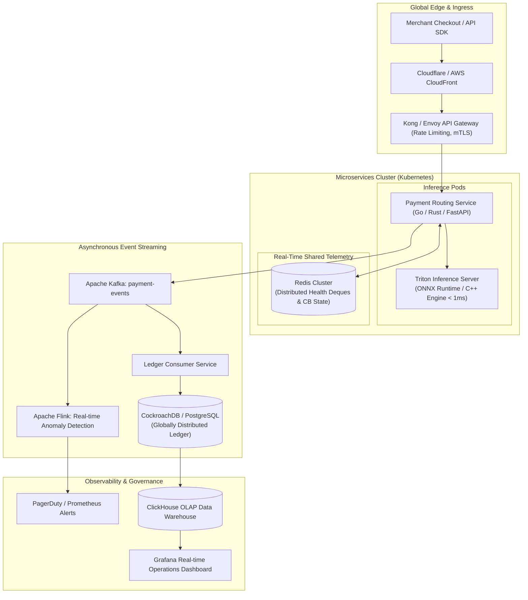

# PayRoute AI — Future Production Architecture Roadmap

**Scope**: Architectural evolution path from local single-node prototype to high-throughput, multi-region distributed production system ($10,000+\text{ TPS}$).

---

## 1. Target Production Architecture

---

## 2. Key Evolution Milestones

### 1. Ultra-Low-Latency Inference (< 1ms SLA)
* Export trained Scikit-Learn / GBDT pipelines to **ONNX / Treelite** format.
* Deploy onto **Triton Inference Server** with C++ gRPC bindings, achieving sub-millisecond scoring per transaction.

### 2. Distributed Circuit Breakers via Redis Cluster
* Replace Python in-memory `collections.deque` with Redis sorted sets (`ZADD`, `ZREMRANGEBYSCORE`) and atomic Lua scripts.
* Ensures state synchronization across multiple horizontal routing pods in under $2\text{ms}$.

### 3. Asynchronous Persistence & High-Throughput Ingestion
* Decouple synchronous API request handling from SQLite database writes using **Apache Kafka** event streaming.
* Event consumer workers ingest millions of transaction logs into distributed SQL databases (**PostgreSQL / CockroachDB**) and OLAP stores (**ClickHouse**).

### 4. Reinforcement Learning & Dynamic Weight Tuning
* Replace fixed linear utility weights ($0.60, 0.20, 0.10, 0.10$) with a contextual multi-armed bandit (LinUCB / Thompson Sampling) that dynamically tunes weights based on real-time bank interchange shifts and merchant SLA contracts.
